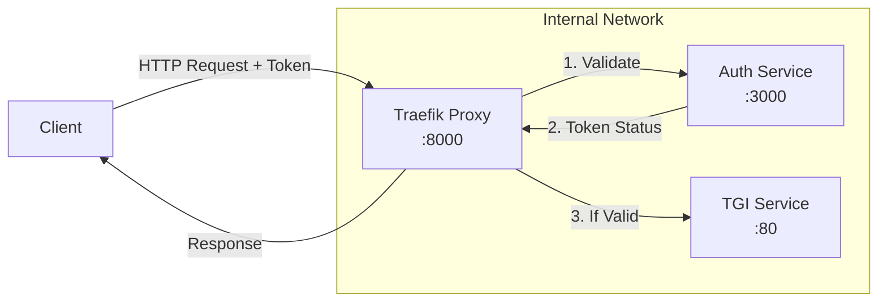

# TGI Models Collection

Welcome to `xpu_tgi`! 🚀  

A curated collection of Text Generation Inference (TGI) models optimized for Intel XPU, with built-in security and traffic management.

<div align="center">

</div>

## Quick Start

```bash
# 1. Generate authentication token
python utils/generate_token.py

# 2. Start a model
./start.sh models/Flan-T5-XXL

# 3. Make a request
curl -X POST http://localhost:8000/generate \
  -H "Authorization: Bearer YOUR_TOKEN" \
  -H "Content-Type: application/json" \
  -d '{"inputs": "What is quantum computing?", "parameters": {"max_new_tokens": 50}}'
```

## Architecture & Security



### Key Features
- 🔒 Token-based authentication with automatic ban after failed attempts
- 🚦 Rate limiting (global: 10 req/s, per-IP: 10 req/s)
- 🛡️ Security headers and IP protection
- 🔄 Health monitoring and automatic recovery
- 🚀 Optimized for Intel GPUs

## Available Models

### Long Context Models (>8k tokens)
- **Phi-3-mini-128k** - 128k context window
- **Hermes-3-llama3.1** - 8k context window

### Code Generation
- **CodeLlama-7b** - Specialized for code completion
- **Phi-3-mini-4k** - Efficient code generation

### General Purpose
- **Flan-T5-XXL** - Versatile text generation
- **Flan-UL2** - Advanced language understanding
- **Hermes-2-pro** - Balanced performance
- **OpenHermes-Mistral** - Fast inference

Each model includes:
- Individual configuration (`config/model.env`)
- Detailed documentation (`README.md`)
- Optimized parameters for Intel XPU

## Security & Configuration

### Authentication
```bash
# Generate secure token (admin)
python utils/generate_token.py

# Example output:
# --------------------------------------------------------------------------------
# Generated at: 2024-03-22T15:30:45.123456
# Token: XcAwKq7BSbGSoJCsVhUQ2e6MZ4ZOAH_mRR0HgmMNBQg
# --------------------------------------------------------------------------------
```

### Traffic Management
```yaml
# Rate Limits
Global: 10 req/s (burst: 25)
Per-IP: 10 req/s (burst: 25)

# Security Headers
- XSS Protection
- Content Type Nosniff
- Frame Deny
- HSTS
```

## API Usage

### Basic Generation
```bash
curl -X POST http://localhost:8000/generate \
  -H "Authorization: Bearer YOUR_TOKEN" \
  -H "Content-Type: application/json" \
  -d '{
    "inputs": "What is quantum computing?",
    "parameters": {"max_new_tokens": 50}
  }'
```

### Advanced Parameters
```bash
curl -X POST http://localhost:8000/generate \
  -H "Authorization: Bearer YOUR_TOKEN" \
  -H "Content-Type: application/json" \
  -d '{
    "inputs": "Explain AI",
    "parameters": {
      "max_new_tokens": 100,
      "temperature": 0.7,
      "top_p": 0.95
    }
  }'
```

### Health Monitoring
```bash
# System health
curl http://localhost:8000/health

# Model status
curl http://localhost:8000/v1/models
```

## Contributing

Contributions are welcome! Please read our [Contributing Guidelines](CONTRIBUTING.md) first.

## License Notes

Each model has its own license terms. Please review individual model READMEs before use.
